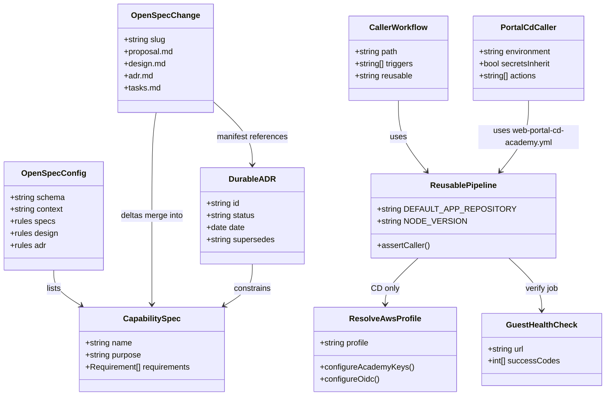

# Align portal pipeline documentation to OpenSpec, OpenSPDD, and MADR

## Requirements

Establish a durable, agent-readable documentation contract for the React web portal so HR-239 pipeline caller behavior and the existing product SDD stay accurate and consistent.

- Record living behavior in OpenSpec (`spec-driven-with-adr`).
- Record implementation constraints in an OpenSPDD REASONS Canvas.
- Record architectural why in MADR-short ADRs under `adr/`.
- Keep `specification/` as product detail; index it; fix environment/CI facts that drifted.
- Do not claim this repository configures ALB target-group health checks.

## Entities

## Approach

1. Documentation architecture:
   - OpenSpec specs = current behavior (what).
   - ADRs = in-force architecture (why).
   - OpenSPDD canvas = this change's executable contract (how).
   - `specification/` = product SDD detail, mapped by `product-features`.

2. Technical implementation:
   - Schema `spec-driven-with-adr` in `openspec/config.yaml`.
   - Artifact order `proposal → specs → design → adr → tasks`.
   - Durable ADRs at `adr/NNNN-kebab-title.md` (MADR-short). Change-local `adr.md` is a manifest only.
   - Align `fast-feedback-pipeline.yml` `DEFAULT_APP_REPOSITORY` with Integration and Release.

3. Business / operator rules:
   - Canonical repo `Heavy-Rental/heavy-rental-react-web-portal`.
   - Paid CD `secrets: inherit`; Academy CD passes Vocareum keys as inputs.
   - CD health = guest `GET /` 200/301/302 via SSM; `/api` is not the gate.

## Structure

### Inheritance Relationships

1. OpenSpec change deltas ADDED/MODIFIED/REMOVED apply onto `openspec/specs/<capability>/spec.md`.
2. A superseding ADR does not edit the prior ADR file; in-force status is derived from `Supersedes:`.
3. Product feature specs are not subclasses of OpenSpec capabilities; `product-features` indexes them.

### Dependencies

1. Design reads in-force ADRs before tasks.
2. Tasks honor OpenSPDD Safeguards and OpenSpec scenarios.
3. `Spec-project-environment.md` depends on `ci-pipelines` and `portal-cd` facts.
4. CD reusable workflow depends on `resolve-aws-profile`, not `resolve-vocareum-aws`.

### Layered Architecture

1. Operator layer: GitHub Actions callers (`portal-*-caller.yml`).
2. Pipeline layer: reusable workflows + composite actions + Ansible under `deploy-pipeline/ansible/`.
3. Contract layer: `openspec/specs/`, `adr/`, `spdd/prompt/`.
4. Product SDD layer: `specification/`.

## Operations

### Create OpenSpec config - `openspec/config.yaml`

1. Responsibility: Declare schema `spec-driven-with-adr` and project context/rules.
2. Constraints: Canonical repo string; conflict rule code/YAML → OpenSpec → specification.

### Create capability specs - `openspec/specs/*`

1. Responsibility: Living SHALL requirements with `#### Scenario` GIVEN/WHEN/THEN.
2. Capabilities: `documentation-system`, `project-environment`, `ci-pipelines`, `portal-cd`, `product-features`.
3. Logic: Match live YAML (including Fast Feedback default repo after edit).

### Create ADRs - `adr/0001` through `adr/0005`

1. Responsibility: MADR-short records for documentation stack, canonical repo, split CD, paid inherit, guest health.
2. Constraints: Status accepted; immutable after write; listed in `adr/README.md`.

### Create OpenSpec change archive - `openspec/changes/archive/2026-08-27-hr-239-portal-pipeline-docs/`

1. Responsibility: proposal, design, adr manifest, tasks (checked), ADDED deltas.
2. Logic: Baseline archive so the next change uses deltas against `openspec/specs/`.

### Update Fast Feedback default - `.github/workflows/fast-feedback-pipeline.yml`

1. Responsibility: Set `DEFAULT_APP_REPOSITORY` to `Heavy-Rental/heavy-rental-react-web-portal`.
2. Constraints: Do not change triggers, caller gate, or Integration steps.

### Update environment SDD - `specification/Spec-project-environment.md`

1. Responsibility: Replace "three caller pairs" with Fast Feedback, Integration, Release, Security Report, Academy CD, paid CD; document paid `secrets: inherit` and Heavy-Rental default.
2. Logic: Append Change Log 2026-08-27 pointing at OpenSpec capabilities and ADRs.

### Create specification index - `specification/README.md`

1. Responsibility: Table of every spec file and its OpenSpec mapping.

### Update root README - `README.md`

1. Responsibility: Accurate `src/` layout, canonical repo, documentation stack pointers.
2. Constraints: Do not restore demo-only claims that contradict `specification/` without listing them as prototype leftovers.

## Norms

1. OpenSpec requirements use RFC 2119 MUST/SHALL; each has at least one `#### Scenario`.
2. ADRs use MADR-short: title, status/date, context, decision, consequences. Sequence `NNNN` is monotonic.
3. OpenSPDD prompt files use `{JIRA}-{TIMESTAMP}-[{ACTION}]-{scope}-{description}.md`.
4. Do not edit accepted ADR files. Supersede with a new file.
5. Workflow comments that operators copy MUST match YAML (Academy: `resolve-aws-profile`; paid: `secrets: inherit`).
6. Markdown in `specification/` keeps existing SDD section names so git history stays reviewable.

## Safeguards

1. Functional: Do not rewrite application TypeScript as part of this documentation change.
2. Functional: Do not add ALB `elbv2` modify-target-group steps to portal CD.
3. Security: Do not commit `sk_` / `whsec_` / Vocareum session tokens. Paid CD inherit does not authorize logging secrets.
4. Security: Do not wire `resolve-vocareum-aws` into portal CD.
5. Consistency: `DEFAULT_APP_REPOSITORY` MUST be identical in Fast Feedback, Integration, and Release (`Heavy-Rental/heavy-rental-react-web-portal`).
6. Consistency: If `Spec-project-environment.md` and `openspec/specs/ci-pipelines/spec.md` disagree, treat YAML as truth and fix both markdown files in one change.
7. Scope: Do not delete `BLANK_README.md` or generic `CHANGELOG.md` in this change (template leftovers noted, not remediated).
8. OpenSpec: Do not store durable ADRs inside `openspec/changes/`.
9. CD health: `verify` MUST NOT fail on `/api` REST errors.
10. Callers: Reusable pipelines MUST keep `assert-caller` gates.
