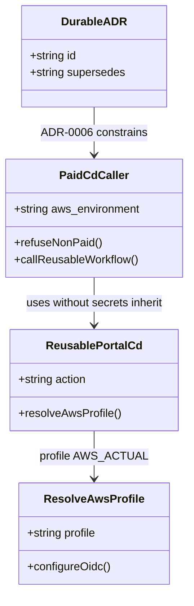

# Stop paid portal CD from inheriting repository secrets

## Requirements

Remove Semgrep `yaml.github-actions.security.secrets-inherit` from paid portal CD without weakening OIDC deploy or mixed-credential refusal.

- Paid CD MUST authenticate with GitHub OIDC only.
- The paid caller MUST NOT use `secrets: inherit` or an unused AWS-key `secrets:` map.
- `refuse-non-paid` MUST still fail if `AWS_ACCESS_KEY_ID` is set on `AWS_ACTUAL`.
- ADR-0006 MUST supersede ADR-0004; do not edit ADR-0004.
- OpenSpec, OpenSPDD, and `specification/Spec-project-environment.md` MUST describe the same rule.

## Entities

## Approach

1. Security:
   - Drop `secrets: inherit` (Semgrep ERROR, least privilege).
   - Do not suppress the rule. Do not pass Vocareum keys “for the refuse check” into the reusable workflow.

2. Pipeline:
   - Caller `refuse-non-paid` keeps the Vocareum-key and environment-name assertions.
   - Reusable jobs keep `environment: AWS_ACTUAL` so `vars.AWS_ROLE_TO_ASSUME` still applies.
   - `id-token: write` stays on caller and reusable workflow.

3. Documentation:
   - OpenSpec delta MODIFIED `portal-cd` paid-secrets requirement.
   - ADR-0006 accepted, supersedes ADR-0004.
   - Stamp the prior REASONS Canvas so it cannot restore inherit.

## Structure

### Inheritance Relationships

1. ADR-0006 supersedes ADR-0004 via `Supersedes:`; ADR-0004 file stays frozen.
2. OpenSpec MODIFIED requirement replaces “Paid CD inherits secrets” in `openspec/specs/portal-cd/spec.md`.

### Dependencies

1. Paid caller `portal-cd` job `needs: refuse-non-paid`.
2. `resolve-aws-profile` on paid uses `vars.AWS_ROLE_TO_ASSUME`, not inherited repository secrets.

### Layered Architecture

1. Caller gate: `refuse-non-paid`.
2. Reusable compose/health: `web-portal-cd-academy.yml`.
3. Contract: `openspec/specs/portal-cd`, ADR-0006, this canvas.

## Operations

### Update caller - `portal-cd-paid-caller.yml`

1. Responsibility: Call reusable CD with inputs only; no `secrets:` key.
2. Logic:
   - `with.aws_environment: AWS_ACTUAL`
   - Comments MUST state OIDC, Semgrep `secrets-inherit`, and `refuse-non-paid`
3. Constraints: No `nosemgrep`. No `secrets: inherit`. No AWS key map.

### Keep gate - `refuse-non-paid`

1. Responsibility: Fail non-`AWS_ACTUAL`, fail if `AWS_ACCESS_KEY_ID` is set, fail if `AWS_ROLE_TO_ASSUME` is empty.
2. Constraints: Job keeps `environment: ${{ inputs.aws_environment }}`.

### Record ADR-0006 - `adr/0006-paid-portal-cd-does-not-inherit-repository-secrets.md`

1. Responsibility: MADR-short; Status `accepted, supersedes ADR-0004`.
2. Constraints: Do not modify `adr/0004-*.md`.

### Update living contracts

1. `openspec/specs/portal-cd/spec.md` requirement title and scenarios as “does not inherit”.
2. `openspec/config.yaml` CI/CD fact line.
3. `specification/Spec-project-environment.md` FR-014 and Change Log.
4. Root README paid CD sentence.
5. Archive OpenSpec change `2026-08-27-hr-239-paid-cd-no-secrets-inherit`.

## Norms

1. RFC 2119 in OpenSpec; MADR-short for ADRs; REASONS sections complete.
2. Accepted ADRs are immutable; supersede instead of editing.
3. Workflow operator comments MUST match YAML (paid: no inherit).
4. Explicit `secrets:` maps are allowed only for secrets the reusable workflow actually uses; paid CD currently uses none.

## Safeguards

1. Security: MUST NOT restore `secrets: inherit` on `portal-cd-paid-caller.yml`.
2. Security: MUST NOT add `nosemgrep` for `secrets-inherit`.
3. Security: MUST NOT pass `AWS_ACCESS_KEY_ID` / `AWS_SECRET_ACCESS_KEY` / `AWS_SESSION_TOKEN` into the paid reusable call.
4. Security: MUST NOT commit `sk_` / `whsec_` / Vocareum session tokens.
5. Functional: MUST NOT remove `refuse-non-paid`.
6. Functional: MUST NOT remove `id-token: write` or OIDC role var usage.
7. Functional: MUST NOT change Academy CD to inherit secrets.
8. Docs: MUST NOT edit ADR-0004; in-force paid-secrets ADR is 0006.
9. Docs: Prior canvas `HR-239-202608271200-[Docs]-portal-pipeline-openspec-openspdd-adr.md` MUST NOT be treated as in-force for paid secrets.
